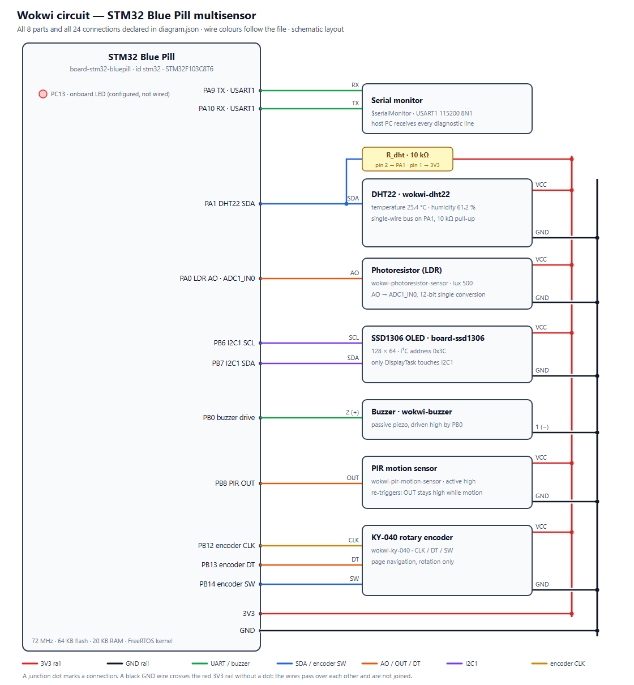
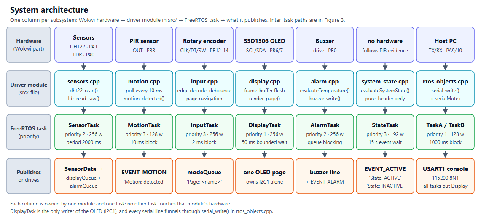
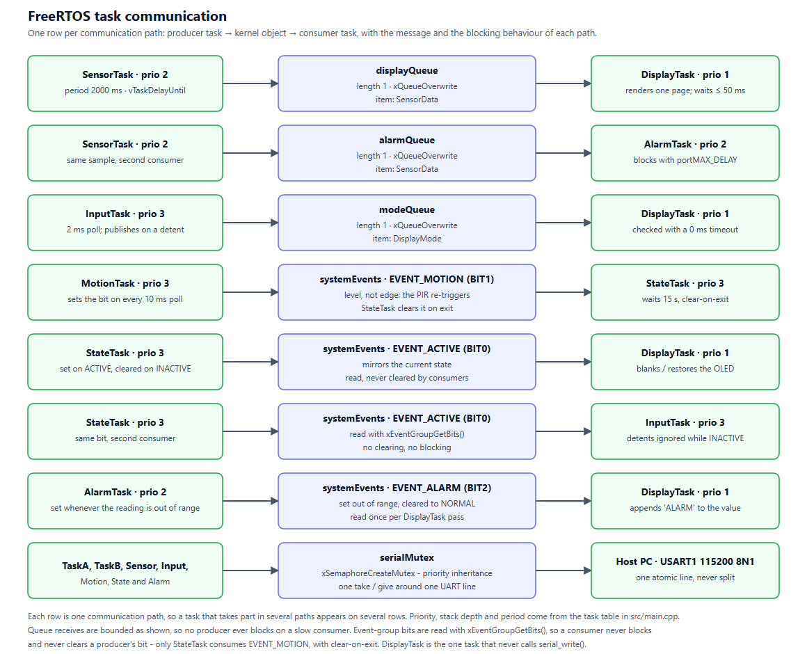
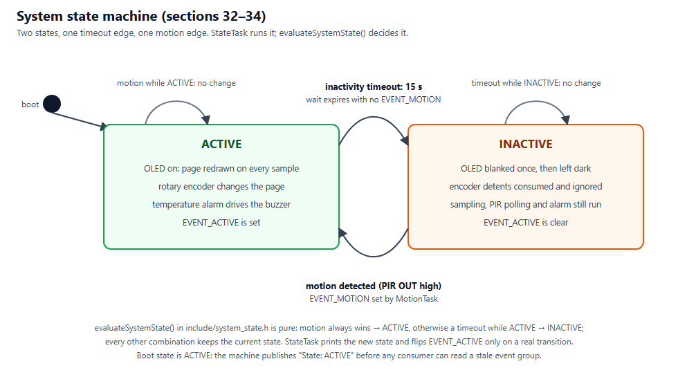
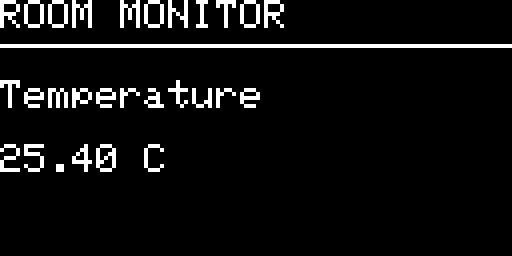

# Simulated STM32 & FreeRTOS Room Monitoring System in Wokwi

Real-Time Multisensor Room Monitoring System.
An STM32 Blue Pill firmware that samples temperature, humidity, light and
motion on FreeRTOS, shows them on an SSD1306 OLED, sounds a temperature
alarm, and parks the display after 15 seconds of inactivity.

* **Target:** STM32 Blue Pill (STM32F103C8T6), simulated in Wokwi
* **Framework:** STM32Cube (HAL + CMSIS) with native FreeRTOS APIs - no Arduino
* **Toolchain:** PlatformIO + Git, host unit tests on `native`
* **Status:** milestones M0-M16 complete; firmware, tests, static analysis,
  functional verification, three fault experiments and the academic report
  are all green

## Project Overview

The assignment is a room monitor with four sensing inputs and three outputs:

* read a **DHT22** (temperature + humidity) and an **LDR** (ambient light),
* watch a **PIR** motion sensor,
* drive a **buzzer** alarm when the temperature leaves 18.0-30.0 degrees C,
* show the readings on a **0.96" SSD1306 OLED**, paged by a **KY-040 rotary
  encoder**, and report everything over **USART1** at 115200 baud.

What makes it an RTOS project rather than a loop with delays is the
structure: eight FreeRTOS tasks, three length-1 queues, one event group and
one mutex, each with a documented priority, stack depth and blocking budget.
Sampling, alarm, display, input, motion and state logic live in their own
modules; `src/main.cpp` performs only the four-stage startup the specification
requires (hardware init -> object creation -> task creation -> scheduler).

The repository also carries the engineering evidence: host unit tests for the
pure logic, a cppcheck findings table, a ten-item functional verification
record from headless Wokwi runs, and three deliberate fault experiments that
show what breaks when blocking, priority or the serial mutex are removed.



*Figure 1 - Wokwi circuit: all eight Wokwi parts and their 24 connections as
wired in `diagram.json`.*

The figure supports the pin-configuration table later in this README: every
wire drawn here terminates on a pin named there, so the schematic and the
firmware's GPIO setup can be checked against each other line by line.

## Features

* **Sensor task** - `SensorTask` samples DHT22 and LDR every 2000 ms on a
  `vTaskDelayUntil()` period; checksum failures retry up to 3 times with a
  100 ms gap, and DHT22 bit timing uses the DWT cycle counter instead of
  `HAL_GetTick()`.
* **Alarm** - `AlarmTask` consumes each sample and drives PB0 through the
  pure `evaluateTemperature()` decision (`<= 18.0` low, `>= 30.0` high,
  inclusive boundaries).
* **Display** - `DisplayTask` is the only task that touches I2C1; it renders
  a 1024-byte framebuffer to the SSD1306 one page at a time and shows four
  pages: Temperature, Humidity, Light, Motion - wrapped in both directions.
* **Input** - `InputTask` polls the rotary encoder every 2 ms, debounces it
  and publishes the selected page; the button pin is wired but deliberately
  unmapped (rotation only, per sections 28-29 of the specification).
* **Motion** - `MotionTask` polls PB8 every 10 ms and sets `EVENT_MOTION`;
  only `StateTask` ever clears that bit.
* **State machine** - `StateTask` runs the ACTIVE/INACTIVE machine: 15
  seconds with no motion blanks the OLED once and ignores the encoder;
  motion restores everything. The decision itself is the pure
  `evaluateSystemState()` in `include/system_state.h`.
* **Serial discipline** - every line goes through `serial_write()`, which
  takes `serialMutex`, so tasks never interleave or lose output to a
  `HAL_BUSY` collision.
* **Diagnostics** - `TaskA`/`TaskB` (section 17) print alternating lines at
  priority 1 with a 500 ms phase offset, demonstrating blocking waits
  without an uncontrolled busy loop.

## Learning Objectives

Worked through the milestones, the project demonstrates:

1. **Task architecture** - choosing priorities from evidence (what breaks if
   it is too high or too low), stack depths from actual call chains, and
   blocking budgets per task; recorded as one justification table in
   `src/main.cpp`.
2. **Inter-task communication** - queues for data (length-1 overwrite so a
   producer never blocks on a slow consumer), an event group for
   level-typed signals, and a mutex with priority inheritance for the one
   shared UART.
3. **Peripheral drivers without an OS abstraction** - bit-banged DHT22 with
   cycle-accurate timing, ADC1 single conversion, I2C1 master, GPIO
   decode for the encoder, all written against the STM32 HAL.
4. **Testability by construction** - splitting pure decisions
   (`evaluateTemperature`, `evaluateSystemState`, `nextDisplayMode`) from
   hardware so the same objects the firmware runs are unit tested on the
   desktop with no `#ifdef` in production code.
5. **Verification as an engineering habit** - cppcheck triaged finding by
   finding, functional tests FT-01..FT-10 executed against the simulator,
   and deliberate faults introduced, observed, analysed and reverted.

## System Architecture

The system is organised as subsystem columns: one Wokwi part, one driver
module, one FreeRTOS task, and the queue/bit that column publishes to.



*Figure 2 - System architecture: hardware -> driver module -> FreeRTOS task ->
what it publishes, one column per subsystem.*

The diagram supports the central structural claim of the design: each column
is owned end to end, so no task can reach into another module's hardware -
`DisplayTask` alone writes the OLED, and every serial line funnels through
`serial_write()` in `rtos_objects.cpp`.

The layering is enforced by the build: `include/` holds only public headers,
`src/` one module per subsystem, and `app_main()` in `src/main.cpp` contains
no sensor, display, alarm or state logic - section 41's four-stage check
comment sits directly above it.

## FreeRTOS Architecture

Kernel configuration (`include/FreeRTOSConfig.h`): preemptive scheduling with
round-robin time slicing (`configUSE_PREEMPTION = 1`,
`configUSE_TIME_SLICING = 1`), `configMAX_PRIORITIES = 7`, 1000 Hz tick,
9 KB heap, mutexes enabled, stack-overflow checking method 2 and a
malloc-failed hook.



*Figure 3 - FreeRTOS task communication: each row is one producer ->
kernel object -> consumer path with its message type and blocking behaviour.*

The figure makes the communication rules concrete: three length-1
`xQueueOverwrite` queues carry the latest sample, three event-group bits
carry state levels (read with `xEventGroupGetBits()`, never cleared by a
consumer), and `serialMutex` is the single take/give around the UART. One
sentence of reading is enough to see that no producer ever blocks on a slow
consumer - DisplayTask can take its full ~100 ms OLED flush without stalling
SensorTask.

Priorities are three levels: 3 for one-shot, edge-like work (`InputTask`,
`MotionTask`, `StateTask`), 2 for the producer and its consumer
(`SensorTask`, `AlarmTask`), 1 for presentation and diagnostics
(`DisplayTask`, `TaskA`, `TaskB`). Shared levels cannot starve each other:
at 3 every task sleeps after microseconds of work, at 2 `AlarmTask` sits in
`xQueueReceive`, at 1 the diagnostics block for 1000 ms.

## Hardware / Simulated Components

All components are simulated in Wokwi; `diagram.json` is the wiring of record.

| Component | Wokwi part | Interface | Role |
| --- | --- | --- | --- |
| MCU | `bluepill_f103c8` (STM32F103C8T6) | - | runs the firmware at 72 MHz (HSE x9 PLL, HSI fallback) |
| DHT22 | `wokwi:dht22` | 1-wire on PA1, 10 k pull-up (`wokwi:resistor-x1`) | temperature + humidity |
| LDR | `wokwi:ldr` | ADC1_IN0 on PA0 | ambient light, 12-bit |
| PIR | `wokwi:pir` | GPIO input on PB8 | motion evidence |
| OLED | `wokwi:oled-ssd1306` | I2C1 on PB6/PB7, address `0x3C` | four paged readings |
| Rotary encoder | `wokwi:rotary-encoder` | GPIO on PB12/PB13/PB14 | page selection |
| Buzzer | `wokwi:buzzer` | GPIO output on PB0, active high | temperature alarm |
| Host PC | serial monitor | USART1 PA9/PA10, 115200 8N1 | log + verification input |

The onboard LED on PC13 is initialised high (off) during hardware init and
never used afterwards; every active indicator in the system is either the
OLED or the buzzer. The circuit itself is drawn in Figure 1, and the table in
the next section names every pin those eight parts land on.

## Pin Configuration

| Pin | Direction | Peripheral | Configuration |
| --- | --- | --- | --- |
| PA0 | input | LDR analogue out | ADC1_IN0, 12-bit single conversion, no DMA |
| PA1 | bidirectional | DHT22 data | open drain with external 10 k pull-up to 3.3 V |
| PA9 | output | USART1 TX | AF push-pull, 115200 8N1 |
| PA10 | input | USART1 RX | floating input (TX-only logging) |
| PB0 | output | Buzzer drive | push-pull, active high |
| PB6 | output | I2C1 SCL -> OLED SCL | AF open drain, external pull-up |
| PB7 | output | I2C1 SDA -> OLED SDA | AF open drain, external pull-up |
| PB8 | input | PIR OUT | floating input, polled every 10 ms |
| PB12 | input | Encoder CLK | internal pull-up, edge decode |
| PB13 | input | Encoder DT | internal pull-up, edge decode |
| PB14 | input | Encoder SW | pull-up, wired but unmapped |
| PC13 | output | Onboard LED | push-pull, written high (off) at init only |

Power: `3V3` rail to every module, common `GND`. The DHT22 pull-up is the
discrete 10 k resistor in `diagram.json`, not an internal pull-up, because
the open-drain line needs a defined rise time for the 1-wire handshake.

## Task Design

Eight tasks, created in `src/main.cpp`; the full priority justification
(each level's budget, what breaks if it is too high, what breaks if it is
too low) lives as one table in that file next to the `xTaskCreate` calls.

| Task | Priority | Stack (words) | Period / blocking | Duty |
| --- | --- | --- | --- | --- |
| `InputTask` | 3 | 256 | 2 ms poll | decode encoder detents, publish page |
| `MotionTask` | 3 | 128 | 10 ms poll | set `EVENT_MOTION` while PIR is high |
| `StateTask` | 3 | 192 | 15000 ms event wait | ACTIVE/INACTIVE machine, sets `EVENT_ACTIVE` |
| `SensorTask` | 2 | 256 | 2000 ms (`vTaskDelayUntil`) | read DHT22 + LDR, publish `SensorData` |
| `AlarmTask` | 2 | 256 | `portMAX_DELAY` on `alarmQueue` | `evaluateTemperature()`, drive buzzer |
| `DisplayTask` | 1 | 256 | waits <= 50 ms on `displayQueue` | render one OLED page |
| `TaskA` | 1 | 128 | 1000 ms block | diagnostic line |
| `TaskB` | 1 | 128 | 1000 ms block, 500 ms start offset | diagnostic line |

Design points behind the table:

* **One-shot work sits highest.** A knob detent and a PIR pulse exist only
  while the pins move, so a missed edge cannot be replayed; a missed
  sensor sample can (it arrives again in 2 s).
* **The producer and its consumer share level 2.** AlarmTask's input only
  changes every 2 s, so that is its whole latency budget - above it buys
  nothing, below it lets an alarm latch after the redraw instead of before.
* **Presentation sits lowest** because section 7 sets no deadline for a
  pixel; TaskA/TaskB are diagnostics nobody acts on, which is the
  definition of "can tolerate latency". TaskA was lowered from priority 2
  in milestone 12: at 2 it could preempt an OLED flush to print a demo
  line, a cost with no benefit.
* **Stacks follow call chains.** 256 words for tasks that `snprintf` and
  transmit (128 overflowed `DisplayTask` on its first page turn), 192 for
  `StateTask` (literal output but an event-wait path), 128 for the two
  GPIO/literal tasks.
* **No busy loops.** Every task sleeps on `vTaskDelay()`, a bounded queue
  receive, or a timeout-bounded `xEventGroupWaitBits()`; section 19's
  uncontrolled-busy-loop prohibition holds everywhere.

## Inter-Task Communication

| Object | Type | Producer(s) | Consumer(s) | Semantics |
| --- | --- | --- | --- | --- |
| `displayQueue` | queue, length 1 | `SensorTask` | `DisplayTask` | latest `SensorData` wins (`xQueueOverwrite`), receive waits <= 50 ms |
| `alarmQueue` | queue, length 1 | `SensorTask` | `AlarmTask` | same sample, second consumer, blocks with `portMAX_DELAY` |
| `modeQueue` | queue, length 1 | `InputTask` | `DisplayTask` | latest `DisplayMode`, polled with 0 ms timeout |
| `systemEvents` `EVENT_MOTION` (BIT1) | event bit | `MotionTask` sets | `StateTask` clears (clear-on-exit wait) | level while PIR is high; only StateTask ever clears it |
| `systemEvents` `EVENT_ACTIVE` (BIT0) | event bit | `StateTask` | `DisplayTask`, `InputTask` | current state; read with `xEventGroupGetBits()`, never cleared by readers |
| `systemEvents` `EVENT_ALARM` (BIT2) | event bit | `AlarmTask` | `DisplayTask` | reading out of range; appended to the OLED value line |
| `serialMutex` | mutex | any task | any task | one atomic line on USART1, priority inheritance bounds inversion |

Why this mix rather than one queue for everything:

* **Length-1 overwrite for samples** - the consumer's ~100 ms OLED flush
  must never stall the producer, and stale data is worse than dropped data:
  only the newest sample is worth rendering or alarming on.
* **Event bits for state** - ACTIVE/INACTIVE and ALARM are levels, not
  messages; `xEventGroupGetBits()` lets a reader check them without
  blocking and without consuming the producer's evidence. Only
  `EVENT_MOTION` is genuinely edge-like, so `StateTask` is the single
  consumer and takes it with clear-on-exit.
* **A mutex, not a queue, for the UART** - the resource is a peripheral, not
  a datum. Before milestone 11 a colliding writer lost its whole line to
  `HAL_BUSY`; the section 17 phase offset alone was not enough.

## State Machine



*Figure 4 - System state machine: two states, one timeout edge, one motion
edge, and the pure `evaluateSystemState()` decision that guards both.*

The machine has exactly two states and two transitions:

* **ACTIVE -> INACTIVE** after `SYSTEM_INACTIVE_TIMEOUT_MS` (15000) with no
  motion: the OLED is blanked once, encoder detents are consumed and
  ignored, and `EVENT_ACTIVE` is cleared. Sampling, PIR polling and the
  alarm keep running - the room is still being monitored, only the display
  goes quiet.
* **INACTIVE -> ACTIVE** on motion: `MotionTask` sets `EVENT_MOTION`,
  `StateTask` wakes, restores the OLED and re-opens the encoder.

Boot starts ACTIVE, and the machine prints `State: ACTIVE` before any
consumer can read a stale event group. Prints happen only on a real
transition, so the serial log's `State:` lines are themselves a test
observable (FT-09/FT-10). The decision logic
(`evaluateSystemState()` in `include/system_state.h`) is pure - motion wins,
a timeout while ACTIVE falls asleep, every other combination holds the
current state - which is what lets `test/test_state` cover it without a
simulator.

## Repository Structure

```
.
├── README.md                  this file
├── platformio.ini             two envs: bluepill_f103c8 (firmware) + native (tests)
├── wokwi.toml                 points the simulator at .pio/build/.../firmware.elf
├── diagram.json               Wokwi circuit (the wiring of record, Figure 1)
├── include/
│   ├── FreeRTOSConfig.h       kernel configuration (7 priorities, 1 kHz tick)
│   ├── rtos_objects.h         queues, event group, mutex, event bits, serial API
│   ├── sensors.h              SensorData, SENSOR_SAMPLE_PERIOD_MS, driver API
│   ├── display.h              display API - OLED owned by DisplayTask
│   ├── input.h                DisplayMode + next/previousDisplayMode()
│   ├── alarm.h                limits, AlarmState, evaluateTemperature()
│   ├── motion.h               PIR polling API
│   ├── system_state.h         SYSTEM_INACTIVE_TIMEOUT_MS, evaluateSystemState()
│   └── glcdfont.h             5x7 glyph table for the SSD1306 (BSD, see assets/)
├── src/
│   ├── main.cpp               four-stage startup + priority table + TaskA/TaskB
│   ├── rtos_objects.cpp       object creation, USART1, serial_write()
│   ├── sensors.cpp            DHT22 + LDR + SensorTask
│   ├── display.cpp            SSD1306 driver + DisplayTask
│   ├── input.cpp              encoder decode + InputTask
│   ├── alarm.cpp              buzzer + AlarmTask
│   ├── motion.cpp             PIR + MotionTask
│   └── system_state.cpp       StateTask
├── scripts/
│   ├── freertos_build.py      compiles the FreeRTOS kernel PlatformIO omits
│   └── native_host_main.*     stub main() so a bare `pio run` stays green
├── test/
│   ├── test_alarm/            10 Unity tests for evaluateTemperature()
│   ├── test_navigation/       11 Unity tests for page wrap-around
│   ├── test_state/            8 Unity tests for evaluateSystemState()
│   └── stubs/                 HAL/FreeRTOS headers the host build resolves
├── docs/
│   ├── laboratory-report.pdf   academic report (sections 57-60) - task table,
│   │                           traceability matrix and engineering analysis
│   ├── laboratory-report.md    editable source of that report
│   ├── static-analysis.md     every cppcheck finding, cause and disposition
│   ├── functional-verification.md   FT-01..FT-10 record with line evidence
│   ├── fault-experiments.md   remove blocking / change priority / drop mutex
│   └── images/                Figures 1-5 (PNG + SVG sources)
└── assets/
    └── LICENSE-glcdfont.txt   BSD licence for the Adafruit GFX font table
```

## Getting Started

**Prerequisites**

* PlatformIO Core (`pio`), e.g. `pip install platformio`
* Git
* For simulation: VS Code with the Wokwi extension, or the `wokwi-cli`
  command-line runner (see the next sections)

**Clone and build**

```
git clone <your-fork-url>
cd bca182-freertos-multisensor
pio run
```

A successful build ends with `SUCCESS` and reports roughly 48 % flash
(31588/65536 bytes) and 55 % RAM (11348/20480 bytes) for the firmware
environment. Nothing is uploaded; the lab runs entirely in simulation.

**Run the checks before you change anything**

```
pio test        # 29 host unit tests
pio check       # cppcheck, 0 high / 0 medium / 35 low findings
```

Both should reproduce the documented baselines. If they do not, your
environment differs from the one the repository was verified on.

## Building the Project

```
pio run                 # build every environment in default_envs
pio run -e bluepill_f103c8    # firmware only
pio run -e native       # host environment only
pio run -t upload       # flash real hardware (not used in the lab)
```

Build details worth knowing before debugging a failure:

* `default_envs = bluepill_f103c8, native` - a bare `pio test` walks this
  same list, which is how the host suites are reached (see `platformio.ini`
  for the PlatformIO resolution rules involved).
* The firmware env carries `test_ignore = *`: the `stm32cube` framework has
  no Unity configuration for the embedded runner, so tests are host-only
  by design.
* `build_flags = -Wl,-u,_printf_float` - newlib-nano drops `%f` otherwise,
  and both the OLED and the serial line print floats.
* `scripts/freertos_build.py` compiles the FreeRTOS kernel that PlatformIO's
  stm32cube builder does not; without it the link fails on `xTaskCreate`.
* `scripts/native_host_main.py` links a stub `main()` into the native env so
  a bare `pio run` reports SUCCESS instead of failing on a missing entry
  point. It is inert during `pio test`.

## Running the Wokwi Simulation

**From VS Code (interactive)**

1. `pio run` to build, 2. `Wokwi: Start Simulator` from the command palette.
   `wokwi.toml` points the simulator at
   `.pio/build/bluepill_f103c8/firmware.elf`, so rebuild after every source
   change.

**Headless (reproducible verification)**

The verification record in
[`docs/functional-verification.md`](docs/functional-verification.md) was
produced with the Wokwi CLI, which needs a token passed through the
`WOKWI_CLI_TOKEN` environment variable (never stored in this repository):

```
$env:WOKWI_CLI_TOKEN = "<your token>"
wokwi-cli --scenario-file <scenario> --serial-log-file run.log --timeout 60000
```

Useful flags: `--expect-text` / `--fail-text` assert on serial output,
`--screenshot-part <id> --screenshot-time <ms>` captures a display part,
`--vcd-file` records digital signals. The CLI's `lint` subcommand validates
`diagram.json`; the project passes it cleanly.

## Unit Testing

```
pio test
```

| Suite | Tests | What it locks down |
| --- | --- | --- |
| `test_alarm` | 10 | `evaluateTemperature()` boundaries: 18.0/30.0 inclusive, each `AlarmState`, NaN-free inputs |
| `test_navigation` | 11 | `nextDisplayMode()` / `previousDisplayMode()` wrap in both directions |
| `test_state` | 8 | `evaluateSystemState()`: motion wins, timeout only from ACTIVE, otherwise hold |
| **Total** | **29** | **29 passing, 0 failing** |

Why the tests are trustworthy: they compile the *production* sources
(`test_build_src = yes`, `build_src_filter = +<alarm.cpp> +<input.cpp>`) -
not copies - and the state rules are header-only, so the firmware and the
tests cannot drift. `test/stubs/` exists only so the STM32 HAL and FreeRTOS
includes resolve on the desktop; nothing links against the stubs, and the
production code contains no `#ifdef UNIT_TEST` anywhere.

Sections 42-44 of the specification call for hardware-independent tests of
exactly this kind: pure functions first, boundaries next, both wrap
directions last.

## Static Code Analysis

```
pio check
```

cppcheck runs once per environment with flags pinned in `platformio.ini`
(`--inline-suppr` plus `warning, style, performance, portability,
unusedFunction`) so the run that produced the report stays reproducible:
**0 high, 0 medium, 35 low** findings (21 under `bluepill_f103c8`, 14 under
`native`).

The table in [`docs/static-analysis.md`](docs/static-analysis.md) classifies
every finding - 3 fixed in code, the rest accepted with a reason (vendor and
macro-mandated casts, signature-mandated parameters, constant-folding
against the test stubs). That document is the section 46 deliverable;
the summary here exists to show the analysis is part of the workflow rather
than an afterthought.

## Functional Verification

Ten functional requirements were exercised end to end in headless Wokwi runs
(`--scenario-file`, `--expect-text`, `--vcd-file` evidence):

| ID | Check | Result |
| --- | --- | --- |
| FT-01 | Changing the DHT22 temperature updates the displayed value | **PASS** |
| FT-02 | Changing the DHT22 humidity updates the displayed value | **PASS** |
| FT-03 | Changing the LDR lux updates the light reading | **PASS** |
| FT-04 | Clockwise encoder detents advance the page (with wrap) | **PASS** |
| FT-05 | Counter-clockwise detents go back (with wrap) | **PASS** |
| FT-06 | Temperature above 30.0 C raises the alarm, buzzer goes high | **PASS** |
| FT-07 | Temperature back in range silences the buzzer (6.000 s pulse) | **PASS** |
| FT-08 | PIR high while ACTIVE keeps the system ACTIVE | **PASS** |
| FT-09 | 15 s without motion transitions to INACTIVE | **PASS** |
| FT-10 | PIR high while INACTIVE returns to ACTIVE | **PASS** |

The full record - scenario inputs, serial line numbers, VCD timestamps and
the honest limits of each run (four checks used synthetic detents/edges
because Wokwi exposes no automation control for those parts) - is in
[`docs/functional-verification.md`](docs/functional-verification.md).



*Figure 5 - Finished system: the OLED page after 9 seconds of a steady-state
run, showing the temperature page rendering the live 25.40 C sample.*

The figure is the visual half of the sensor path: it proves the display
subsystem renders real `SensorData` from `displayQueue`, not a placeholder -
the same 25.40 C value that appears on the serial line in the FT-01 record.

A separate document, [`docs/fault-experiments.md`](docs/fault-experiments.md),
records three deliberate regressions from sections 49-51: removing a
blocking call, changing a task priority, and deleting the serial mutex -
each with the change, the observed symptom, the analysis, and the verified
restoration afterwards.

## Engineering Decisions

* **One module per subsystem, `main.cpp` only starts things.** Section 41's
  four-stage check (init -> objects -> tasks -> scheduler) is enforced by
  construction; no sensor or display logic can hide in an init function.
* **Queues of length 1 with `xQueueOverwrite`.** Only the newest sample is
  worth acting on, and this removes any chance that DisplayTask's OLED flush
  stalls SensorTask - the classic slow-consumer deadlock has no edge here.
* **Single-owner OLED instead of a display lock.** Section 26's ownership
  rule *is* the synchronisation: one task, one bus, zero mutexes around
  I2C1.
* **Pure decisions, hardware at the edges.** `evaluateTemperature()` and
  `evaluateSystemState()` take values and return values - no HAL, no queue,
  no clock - which is what makes 29 desktop tests possible against the exact
  production objects.
* **DWT cycle counter for DHT22 timing.** The 1-wire protocol needs
  microsecond edges; `HAL_GetTick()` is 1 ms and `HAL_Delay()` blocks, so
  the driver counts CPU cycles (72 cycles/us at 72 MHz) and suspends the
  scheduler only inside the ~5 ms frame, before any print.
* **Mutex for the UART, not a queue.** A queue would serialise messages but
  cannot stop a second task from starting a transmit in the middle of the
  first; the mutex guards the peripheral, priority inheritance bounds the
  inversion to one 15-byte line.
* **Priorities justified in one table.** Section 39 asks what breaks if a
  priority is wrong; the answer lives next to the `xTaskCreate` calls it
  applies to, including the milestone-12 demotion of TaskA from 2 to 1.
* **`-Wl,-u,_printf_float` instead of integer formatting.** Pulling in the
  float formatter costs flash but keeps `%f` honest in both outputs;
  hand-rolled fixed-point would have spread rounding decisions through the
  display code.
* **cppcheck flags written down rather than defaulted.** Specifying any
  flags switches off PlatformIO's implicit defaults, so the exact set is in
  `platformio.ini` to make `docs/static-analysis.md` reproducible.

## Limitations

* **Simulation fidelity.** Everything runs in Wokwi: the DHT22, LDR, PIR and
  encoder are models. Timing that the simulator tolerates (e.g. the
  scheduler suspension during a DHT22 frame) should be re-measured on real
  silicon.
* **Four verification steps used synthetic stimulus.** Wokwi exposes no
  automation control for the rotary encoder or the PIR element, so FT-04,
  FT-05, FT-08 and FT-10 were driven by scenario pulses on the nets with
  VCD confirmation. They demonstrate firmware behaviour, not the physical
  sensor's electrical behaviour. This is documented per-run in
  `docs/functional-verification.md`.
* **No real-time statistics.** `configGENERATE_RUN_TIME_STATS` is 0 - CPU
  utilisation per task is argued from blocking budgets, not measured.
* **Heap use is minimal, not eliminated.** Objects are created before the
  scheduler starts; there is no allocation at run time, but a heap-tracking
  diagnostic would catch stack/heap collisions earlier than the
  stack-overflow hook.
* **USART1 RX is configured but unused.** The system is output-only; the
  input path for verification is the simulator's scenario control, not a
  command console on PA10.
* **No hardware-in-the-loop run.** `pio run -t upload` exists but was never
  executed; the lab specification scopes the deliverable to simulation.

## Future Improvements

* Runtime CPU statistics per task (`configGENERATE_RUN_TIME_STATS` with a
  timer) to replace the argued-but-unmeasured utilisation claims.
* A small command protocol on the existing USART1 RX (thresholds, page
  select) - the pin and driver are already initialised.
* A watchdog task (`xTaskWatchdogTimer` style) asserting that each task
  reported in within its budget, turning the blocking-budget table into an
  executable assertion.
* Calibration values for the LDR lux mapping instead of the current
  relative-percentage curve, and EEPROM/flash storage for them.
* Union of DHT22 and PIR into a "comfort index" page, exercising the
  display path with cross-task derived data.
* Hardware-in-the-loop validation on a physical Blue Pill once the
  simulation scope of the laboratory is complete.

## References and Acknowledgments

* **Laboratory specification** - `../Laboratory 1/BCA182 - Laboratory
  Activity 1.md`, BCA182 Embedded Systems Programming. Section numbers cited
  in this README and in the source comments refer to it.
* **FreeRTOS** - Richard Barry et al., FreeRTOS reference and the kernel
  shipped inside PlatformIO's `framework-stm32cubef1`.
* **STM32 HAL/CMSIS** - STMicroelectronics, `stm32f1xx_hal` drivers used
  throughout (`HAL_ADC_*`, `HAL_I2C_*`, `HAL_UART_*`, GPIO).
* **Wokwi** - the simulator (bluepill_f103c8, dht22, ldr, pir,
  oled-ssd1306, rotary-encoder, buzzer parts) and its CLI used for headless
  verification.
* **PlatformIO** - build system, `pio test` Unity runner and `pio check`
  cppcheck integration.
* **Adafruit GFX** - the 5x7 glyph table in `include/glcdfont.h` is
  redistributed under the BSD licence; the full text is in
  [`assets/LICENSE-glcdfont.txt`](assets/LICENSE-glcdfont.txt).
* **cppcheck** - static analyser, findings triaged in
  [`docs/static-analysis.md`](docs/static-analysis.md).
* **Hackster.io portfolio post** - the public showcase article lives in
  [`docs/hackster-article.md`](docs/hackster-article.md); it is written and
  ready, but pending publication (see its checklist).
